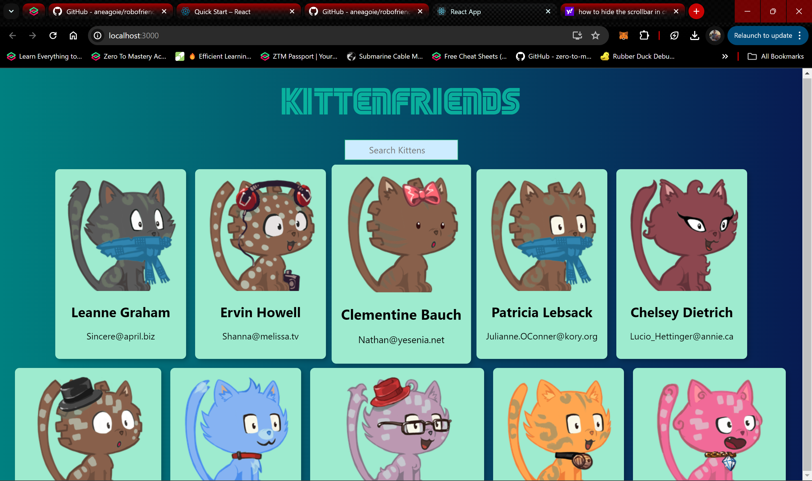

# Getting Started with Create React App

This project was bootstrapped with [Create React App](https://github.com/facebook/create-react-app).

---

**Preview:**



---

**Kitten Friends**

**Description:**
Kitten Friends is a simple React application that allows users to search for cute kitten images. Users can search for kittens by their name, and the app fetches kitten images from an API and displays them dynamically. This project serves as a fun way to practice React concepts like state management, component lifecycle, and API integration.

**Features:**
- Search for kitten images by name.
- Dynamic display of kitten images based on search query.
- Responsive design for seamless user experience across devices.
- Fetches data from the [Kitten API](https://thecatapi.com/).

**Demo:**
Check out the live demo of the app [kittenfriends](https://c0des-by-sagar.github.io/kittenfriends/).

**Installation:**
1. Clone the repository: `git clone https://github.com/C0des-by-SAGAR/kittenfriends.git`
2. Navigate to the project directory: `cd kittenfriends`
3. Install dependencies: `npm install`
4. Start the development server: `npm start`
5. Open your browser and visit `http://localhost:3000` to view the app.

---

**Adding Your Name to the Kittens List:**

If you'd like to see your name among the friendly kitten enthusiasts in our app, follow these simple steps:

1. **Fork the Repository:**
   Start by forking the project repository on GitHub. This will create a copy of the project under your GitHub account, allowing you to make changes without affecting the original repository.

2. **Create a New Branch:**
   Once you've forked the repository, create a new branch where you'll make your changes. This keeps your work isolated and makes it easier to manage contributions.

   ```bash
   git checkout -b newbranch
   ```

3. **Modify the `robots.js` File:**
   Navigate to the `src/container` folder within the project directory and locate the `robots.js` file. Open it in your preferred text editor.

4. **Add Your Information:**
   In the `robots.js` file, follow the existing format to add your information to the list of kitten enthusiasts. Make sure to replace `[proper serial number]`, `'Your Name'`, `'Your Username'`, and `'random email of yours'` with your own details.

   ```javascript
   {
     id: [proper serial number],
     name: 'Your Name',
     username: 'Your Username',
     email: 'random email of yours'
   },
   ```

5. **Save Your Changes:**
   After adding your information, save the `robots.js` file.

6. **Stage and Commit Your Changes:**
   Use Git to stage and commit your changes with a descriptive message.

   ```bash
   git add .
   git commit -m "Added my name to the robots.js list"
   ```

7. **Push Your Changes:**
   Once you've committed your changes, push them to your forked repository on GitHub.

   ```bash
   git push origin newbranch
   ```

8. **Submit a Pull Request:**
   Finally, navigate to your forked repository on GitHub and submit a pull request. Provide a clear description of the changes you've made and any relevant context.

Once your pull request is reviewed and accepted, your name will be proudly displayed among our esteemed kitten enthusiasts in the app!

---

**Usage:**
1. Enter a kitten name in the search bar.
2. Press enter or click the search button.
3. Enjoy browsing through adorable kitten images!

**Technologies Used:**
- React.js
- JavaScript
- CSS
- HTML

**Credits:**
This project was created by [Sagar](https://github.com/C0des-by-SAGAR). The kitten images are fetched from the [Kitten API](https://thecatapi.com/).

**Contributing:**
Contributions are welcome! If you'd like to contribute to the project, feel free to submit a pull request.

**License:**
This project is licensed under the MIT License. See the [LICENSE](https://github.com/C0des-by-SAGAR/kittenfriends/blob/main/LICENSE) file for more details.
